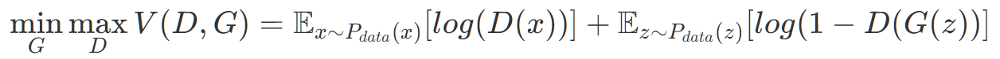
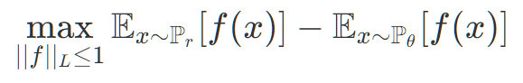
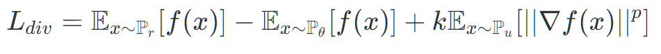
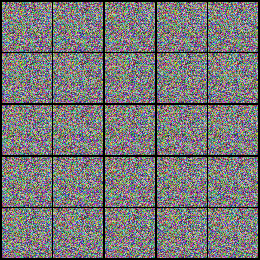

# Wasserstein Divergence GAN

### GANs Background
Generative Adversarial Networks, or GANs for short, are comprised of two neural networks: a generator $G()$, and discriminator $D()$. The Generator's task is to produce fake images that closely resemble real images. The discriminator's task is to predict whether a given image is fake or not. 

$G()$ typically samples some latent space noise, $z$, and outputs a fake image. $D()$ takes as input an image $x$, and outputs some probability of it being real, $y$. Therefore, the value $D(G(z))$ is the probability of the fake image being real. The discriminator must minimise this value while maintaining high output values for real images, while the generator wants to maximise this value.Hence, by playing this adversarial game, the generator learns some function that minimises the distance between the probability distributions of fake and real images.

This is nicely surmised in the loss function:

Here, we can see the discriminator wants to maximise $log(D(x))$, while the generator wants to minimise $log(1-D(G(z)))$. For a more comprehensive evaluation of GANs, we direct the reader to the [original paper](https://proceedings.neurips.cc/paper/2014/file/5ca3e9b122f61f8f06494c97b1afccf3-Paper.pdf).

An issue with this approach is that it is unstable, and so [Wasserstein loss](https://arxiv.org/abs/1701.07875) was introduced to improve stability. This loss function takes the form:

Here, the first term corresponds to the real data, and the second term corresponds to generated images; the discriminator has been changed to a "critic" to represent that its outputs are no longer in the range $[0,1]$. The generator needs to minimise this expression, while the discriminator wants to maximise it. The constraint means that the norm of the gradient must be less than or equal to 1 (1-Lipschitz continuous). To appropriately enforce this constraint, there have been several proposed methods, here we use the method presented in [Wasserstein Divergence for GANs](https://arxiv.org/pdf/1712.01026.pdf). Here, the constraint is enforced by adding an additional term to the loss function:

## Implementation
This project is written in Python3 and PyTorch, and offers both dense and fully convolutional models. Simply change the config file to finetune!

### Training Loop
